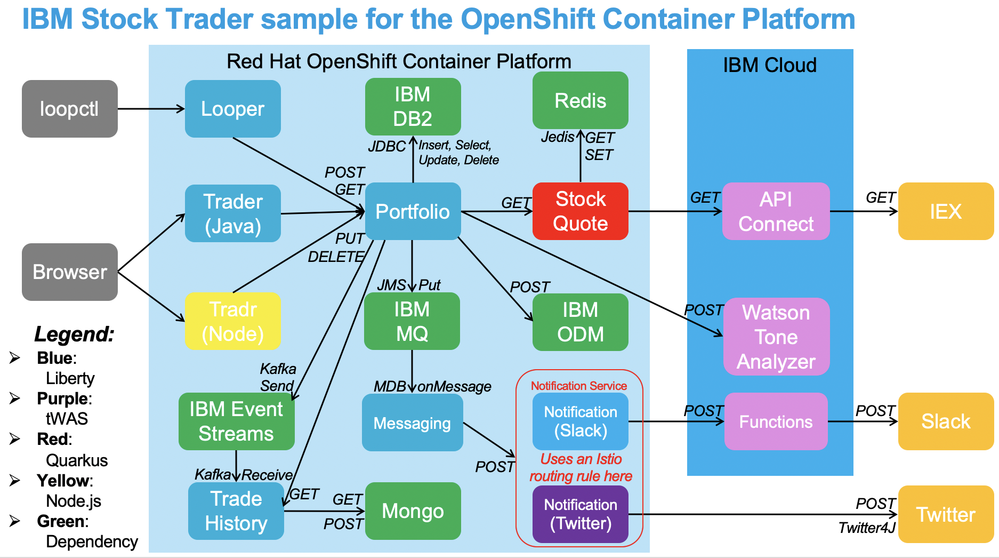

# Stock Trader
This repository holds the umbrella helm chart for the IBM Stock Trader sample (see the sibling `stocktrader-operator` repository for the equivalent umbrella operator, for use with the OpenShift Container Platform).  Note that you may wish to also follow along with the blog post I recently made about how to use this helm chart:
https://medium.com/cloud-engagement-hub/using-an-umbrella-helm-chart-to-deploy-the-composite-ibm-stock-trader-sample-3b8b69af900d

The IBM Stock Trader application is a simple stock trading sample where you can create various stock portfolios and add shares of stock to each for a commission.
It keeps track of each porfolio's total value and its loyalty level which affects the commission charged per transaction.
It sends notifications of changes in loyalty level.
It also lets you submit feedback on the application which can result in earning free (zero commission) trades, based on the tone of the feedback.



The broker microservice sits at the center of the application.  This microservice 
* calls the portfolio microservice, which persists portfolios using JDBC and calls the stock-quote microservice
* calls the account microservice, which persists accounts to Cloudant and drives calls to ODM and JMS 
* calls the trade-history microservice, which persists trades to Mongo

There is a Message Driven Bean (MDB) which listens for the messages sent from account and which invokes a notification microservice.
There are 2 notification microservices: 
* notification-slack which sends the notification to a Slack channel (using a "serverless" IBM Cloud Functions action sequence)
* notification-twitter which sends the notification as a tweet to a Twitter account

Both use the same service called `notification-service`.
If you do not have Istio in your cluster, you need to choose which microservice to deploy.
If you have Istio in your cluster, you can deploy both.
You must manually create the Istio routing rules (see the notification-slack and notification-twitter projects for samples).

## Prerequisites

* IBM Cloud Private installed
* IBM Cloud public account (trial account can be used)

The following installation instructions guide you through installing the dependent software (DB2, MQ, etc) and configuring it for use by the
stocktrader application.  After the dependent software is installed and configured, the stocktrader application is installed.

## General preparation for installation

Clone this project so that you can run the configuration scripts from your workstation.

After cloning this project, clone the other stocktrader projects as siblings of this project since they are needed by some of the configuration scripts.
You can do so by running `./stocktrader/scripts/cloneProjects.sh` from the same working directory
where you cloned this project.

You need to be logged in to your IBM Cloud Private instance via the CLI when running any of the configuration scripts.
See [these instructions](https://www.ibm.com/support/knowledgecenter/en/SSBS6K_2.1.0.3/manage_cluster/cli_commands.html#pr_login).

The following instructions and the configuration scripts assume that you will deploy the stocktrader application in the `stocktrader` Kubernetes namespace.
If you want to use a different namespace, then update your copy of the `variables.sh` file in the `scripts` folder to change the desired namespace.
Also use that namespace in any kubectl commands provided below in place of `stocktrader`.

## Install and configure DB2

1. Log in to your IBM Cloud Private management console.
2. Click the `Catalog` button.
3. Type `db2` into the search bar to find the IBM Db2 Developer-C Helm chart.  Click on the chart.
4. Perform the prerequisites for DB2 installation as directed by the chart's instructions.
5. Click the `Configure` button to display the chart's configuration parameters.
    * Set the database name to `trader`.
    * Review the other parameters and complete all required fields.
    * Click the `Install` button.
6. Monitor the deployment and verify that the DB2 pod starts.
7. Edit the `variables.sh` file in your copy of the `scripts` folder.
Review the variable settings in the DB2 section.
Change values if necessary.
8. Open a command window on your workstation.
    * Set the current directory to the `scripts` folder.
    * Run the `./setupDB2.sh` script.
    This script configures a secret for the portfolio application to access DB2 with the proper endpoint and credentials.
    It also creates the DB2 tables for the application.

## Install and configure MQ

1. Log in to your IBM Cloud Private management console.
2. Click the `Catalog` button.
3. Type `mq` into the search bar to find the IBM MQ Advanced for Developers Helm chart.  Click on the chart.
4. Perform the prerequisites for MQ installation as directed by the chart's instructions.
5. Click the `Configure` button to display the chart's configuration parameters.
    * Review the parameters and complete all required fields.
    * Click the `Install` button.
6. Monitor the deployment and verify that the MQ pod starts.
7. Edit the `variables.sh` file in your copy of the `scripts` folder.
Review the variable settings in the MQ section.
Change values if necessary.
8. Open a command window on your workstation.
    * Set the current directory to the `scripts` folder.
    * Run the `./setupMQ.sh` script.
    This script configures a secret for the portfolio application to access MQ with the proper endpoint and credentials.
    It also creates the MQ message queue for the application.

## Install and configure ODM

1. Log in to your IBM Cloud Private management console.
2. Click the `Catalog` button.
3. Type `odm` into the search bar to find the IBM Operational Decision Manager (ODM) Helm chart.  Click on the chart.
4. Perform the prerequisites for ODM installation as directed by the chart's instructions.
5. Click the `Configure` button to display the chart's configuration parameters.
    * Review the parameters and complete all required fields.
    * Click the `Install` button.
6. Monitor the deployment and verify that the ODM pod starts.
7. Install [curl](https://curl.haxx.se/download.html) and [jq](https://stedolan.github.io/jq/download/) on your workstation if you do not already have them.
8. Edit the `variables.sh` file in your copy of the `scripts` folder.
Review the variable settings in the ODM section.
Change values if necessary.
9. Open a command window on your workstation.
    * Set the current directory to the `scripts` folder.
    * Run the `./setupODM.sh` script.
    This script configures a secret for the portfolio application to access ODM with the proper endpoint and credentials.
    It also creates the ODM decision service for the application and deploys it.

## Install and configure Redis

1. Log in to your IBM Cloud Private management console.
2. Click the `Catalog` button.
3. Type `redis` into the search bar to find the Redis Helm chart.  Click on the chart.
4. Perform the prerequisites for ODM installation as directed by the chart's instructions.
5. Click the `Configure` button to display the chart's configuration parameters.
    * Review the parameters and complete all required fields.
    * Click the `Install` button.
6. Monitor the deployment and verify that the Redis pods start.
7. Edit the `variables.sh` file in your copy of the `scripts` folder.
    * Review the variable settings in the Redis section.
    * Change values if necessary.
8. Open a command window on your workstation.
    * Set the current directory to the `scripts` folder.
    * Run the `./setupRedis.sh` script.
    This script configures a secret for the portfolio application to access Redis with the proper endpoint.


## Install and configure Tone Analyzer

1. Log in to the [IBM Cloud Public console](https://console.bluemix.net/).
2. Click the `Catalog` button.
3. Type `tone analyzer` into the search bar to find the Tone Analyzer service.  Click on the service.
4. Choose a plan and click the `Create` button.
5. After the service is created, click on the `Manage` tab to view the credentials for connecting to the service.
6. Open a command window on your workstation.
Make sure your kubectl context is set to your ICP instance.
Enter the following command.

    ```console
    kubectl create secret generic watson --from-literal=url=<Url>/v3/tone?version=2017-09-21 --from-literal=id=<Username> --from-literal=pwd=<Password> -n stocktrader
    ```

    where `<Url>`, `<Username>` and `<Password>` are the credentials that appear on the `Manage` tab of the tone analyzer service.

## Install stock API with API Connect

1. Log in to the [IBM Cloud Public console](https://console.bluemix.net/).
2. Click the `Catalog` button.
3. Type `API connect` into the search bar to find the API Connect service.  Click on the service.
4. Choose a plan and click the `Create` button.
5. On the IBM Cloud dashboard, click on your provisioned API connect service to open it.
6. Click on the `sandbox` catalog icon.
7. Click on the "navigate to" button (labeled `>>`) in the menu bar.  Select "Drafts" from the drop-down menu.
8. Click on the `APIs` tab in the menu bar.
9. Click on the `Add` button and then select `Import API from a file or URL` from the drop-down menu.
10. Click on the `Select File` button.  In the file dialog navigate to your copy of this project.
Select the `stock-quote-api_1.0.0.yaml` file from the `scripts` folder and click the `Open` button.
11. Tick the "Add a product" box.  Set the title field to stocktrader.
12. Tick the "Publish this product to a catalog" box (if not already ticked).
13. Click the `import` button.
14. Click on the "navigate to" button (labeled `>>`) in the menu bar.  Select "Dashboard" from the drop-down menu.
15. Click on the `sandbox` catalog icon.
16. Click `Settings` in the menu bar and then click on the `Gateways` tab.
Copy the URL to your clipboard.
17. Open a command window on your workstation.
Make sure your kubectl context is set to your ICP instance.
Enter the following command.

    ```console
    kubectl create secret generic stockquote --from-literal=url=<URL>/stocks -n stocktrader
    ```

    where `<URL>` is the value you copied to your clipboard.

## Install and configure Slack cloud function (optional)

If you want to install the stocktrader Slack notification project, follow these steps to configure an IBM Cloud Function to post messages to your Slack workspace.

1. Configure a [Slack incoming webhook](https://api.slack.com/incoming-webhooks) for your Slack workspace.
2. Set up the [Cloud Functions CLI plug-in](https://console.bluemix.net/docs/openwhisk/bluemix_cli.html#cloudfunctions_cli) if you do not already have it.
3. Open a command window on your workstation.
    * Log in to your public IBM Cloud account using the `ibmcloud login` command.
    * Set your Cloud Foundry org and space using the `ibmcloud target --cf` command.
    * Set the current directory to the `scripts` folder.
    * Run the `./setupCloudFunctions.sh` script.
    This script creates an IBM Cloud Function action sequence to post a message to your Slack workspace and tests it.
4. Run the following commands.

    ```console
    ibmcloud fn action get stocktrader/PostLoyaltyLevelToSlack --url

    ibmcloud fn property get --auth
    ```

    The first command displays the URL of the cloud function that was created.
    The second command displays your credentials (id and password) for invoking the cloud function.

5. Change the kubectl context to your ICP instance.
Run the following command.

    ```console
    kubectl create secret generic openwhisk --from-literal=url=<URL> --from-literal=id=<ID> --from-literal=pwd=<PASSWORD> -n stocktrader
    ```

    where `<URL>` is the URL of the cloud function that was created and `<ID>` and `<PASSWORD>` are the id and password from the credentials.

## Configure Twitter (optional)

If you want to install the stocktrader Twitter notification project, follow these steps.

1. Create a [Twitter app](https://apps.twitter.com/).
2. Open a command window on your workstation.
Run the following command.

    ```console
    kubectl create secret generic twitter --from-literal=consumerKey=<CONSUMER_KEY> --from-literal=consumerSecret=<CONSUMER_SECRET> --from-literal=accessToken=<ACCESS_TOKEN> --from-literal=accessTokenSecret=<ACCESS_TOKEN_SECRET> -n stocktrader
    ```

    where `<CONSUMER_KEY>`, `<CONSUMER_SECRET>`, `<ACCESS_TOKEN>` and `<ACCESS_TOKEN_SECRET>` are obtained from Twitter following successful creation of your Twitter app.

## Install stocktrader Helm chart

1. [Set up the Helm CLI to work with IBM Cloud Private.](https://www.ibm.com/support/knowledgecenter/en/SSBS6K_2.1.0.3/app_center/create_helm_cli.html)
2. Review the values.yaml file.  By default the tradr (node.js application), notification-slack, notification-twitter and trade-history projects are not deployed.
If you want to deploy any of those projects, you will need to request it via command-line option or via your own values yaml file.
3. Install the chart.
Here is a sample helm install command.

    ```console
    helm install stocktrader --tls --name stocktrader --namespace stocktrader --set notificationSlack.enabled=true
    ```

    This command creates a Helm release named `stocktrader`.  The Kubernetes resources are created in a namespace called `stocktrader`.
    The ``--set`` argument shows how to deploy an optional project, in this case notification-slack.
